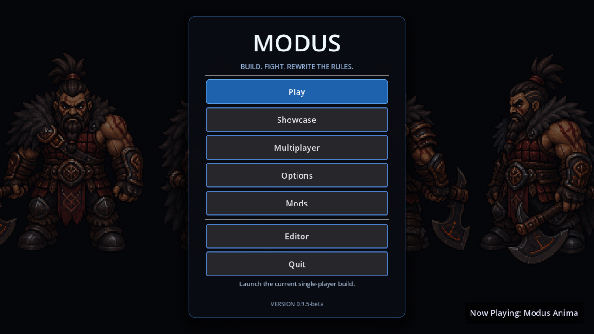
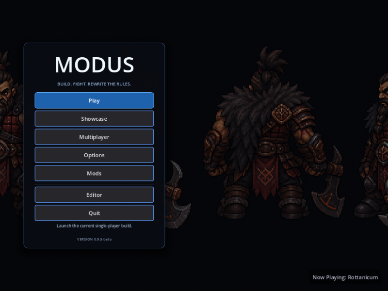
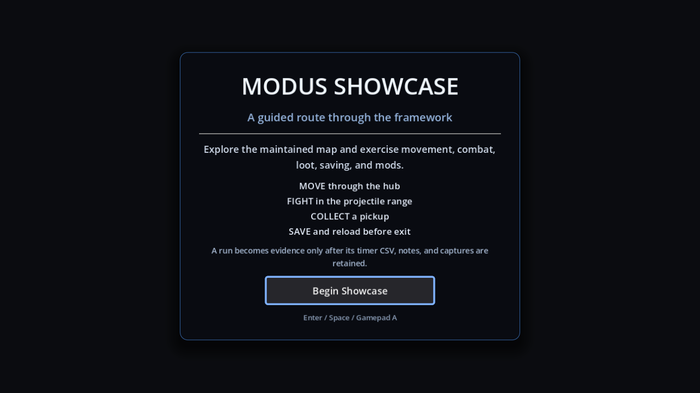
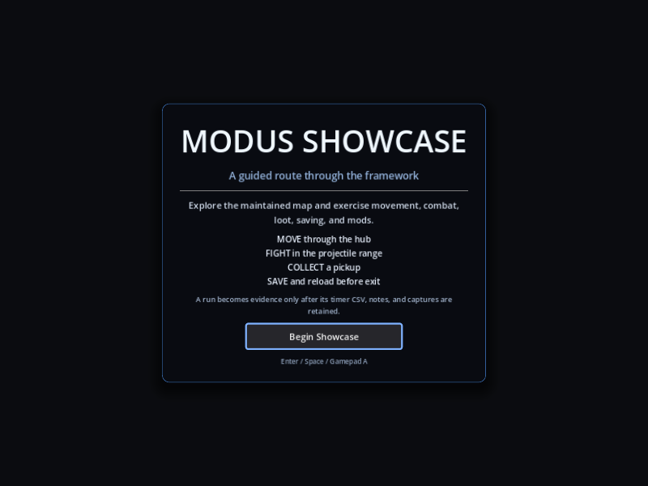
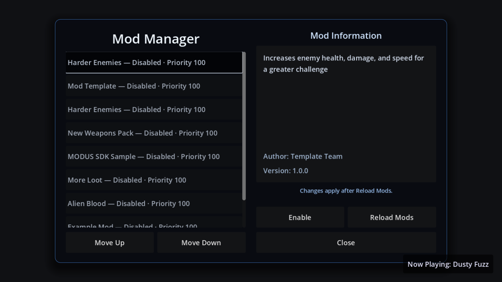
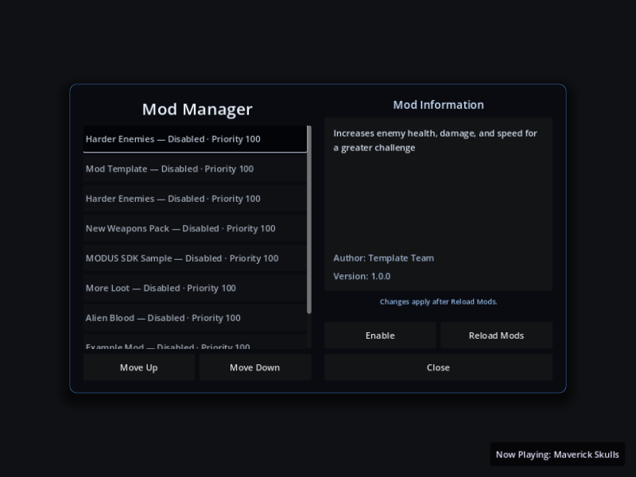
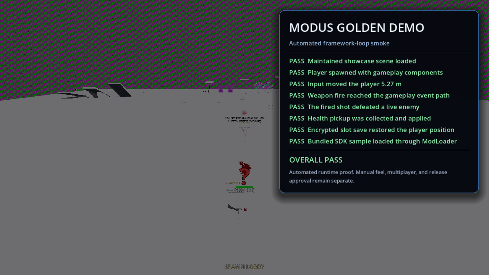
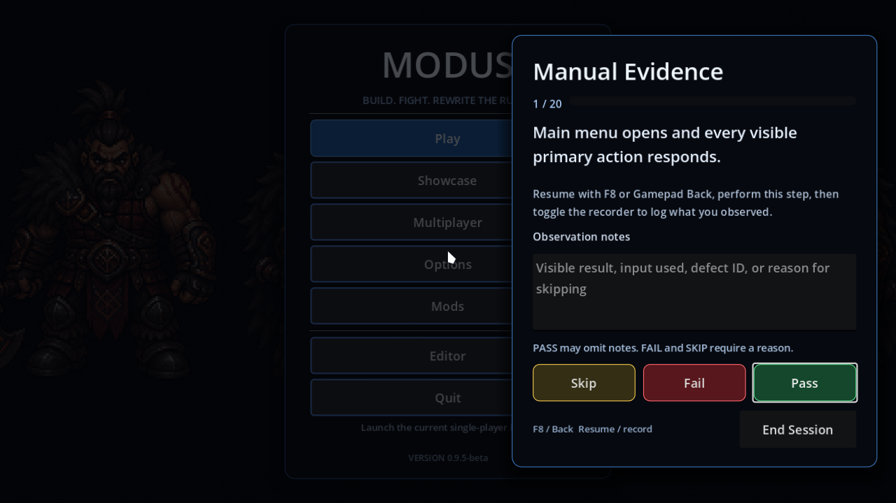
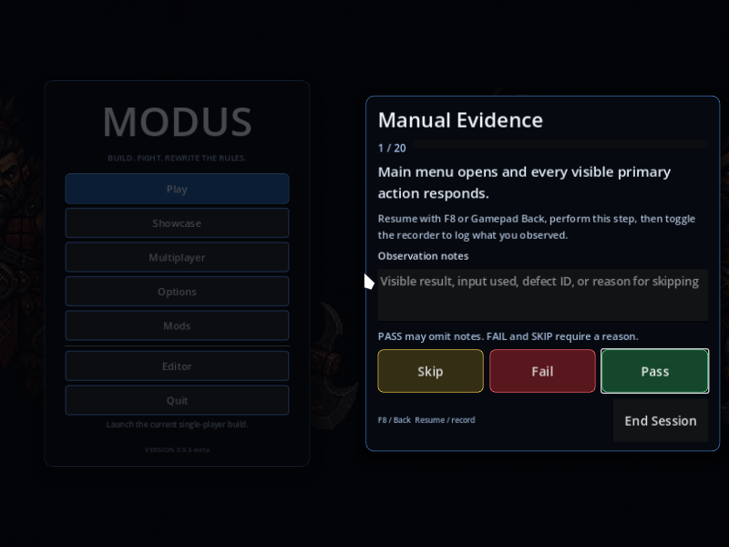

# MODUS Release Evidence Bundle

> **Documentation status: maintained reference.** These artifacts prove only the named capture boundary; they are not manual gameplay, performance, multiplayer, or release approval.

**Updated:** August 4, 2026
**Status:** EVIDENCE INDEX COMPLETE — release approval remains blocked by manual evidence, provenance, packaging, and external/runtime clearance

This published index preserves dated observations and curated media; it is not a fresh verification run. Raw `logs/`, generated reports, and historical session documents remain local-only and are absent from fresh clones. See [report regeneration](DOCUMENTATION_TRUTH.md#regenerating-local-reports) for commands and prerequisites. The August menu images predate the subsequent artwork removal and do not prove the current rendered menu.

## Main Menu Captures

| Artifact | Resolution | SHA-256 | Boundary |
| --- | ---: | --- | --- |
| `media/release/main_menu_1280x720.png` | 1280×720 | `9615dbafca1cb7f64a4b40648a192f65c7531e20d4dd5dbda43baa8562931ad5` | August 2 Xvfb render of the maintained main-menu scene |
| `media/release/main_menu_800x600.png` | 800×600 | `e7e6d9aba02aa13a0e36f0628125decf7af1f8a4752786e138d7235d492f5b04` | August 2 narrow-window render of the maintained main-menu scene |
| `media/release/showcase_welcome_1280x720.png` | 1280×720 | `f43faf67b5c9f7fab75e713f0458a26f58be2af95e0020c0e10a049c5e8db4f0` | August 2 Xvfb render of the localized showcase welcome/evidence panel |
| `media/release/showcase_welcome_800x600.png` | 800×600 | `95babffbe28608d018ce8ce1522d51893e121b4c8c0a29bf315ca22678cbc84c` | August 2 narrow-window render of the welcome/evidence panel |
| `media/release/mod_manager_1280x720.png` | 1280×720 | `f45cd8cee33d9d67f85b0a705ff50b442ce16878e13132e10b605bee095423c6` | Responsive localized mod workflow with selected-package detail |
| `media/release/mod_manager_800x600.png` | 800×600 | `76345902dbf314e99156aba0c86a1ee0b272fd7a58f12d6efaa01f4e6c25120b` | Constrained-window mod workflow capture |

The August UI captures record readable hierarchy, contrast, responsive containment, visible version truth, the player-visible Showcase entry, the then-present hero artwork, the localized gamepad-ready route/evidence panel, and responsive mod selection/reload workflow. Focused UI proof at that boundary was 26/26. They do not prove current appearance or manual input feel.

## Automated Golden Demo

| Artifact | SHA-256 | Boundary |
| --- | --- | --- |
| `media/release/golden_demo_smoke_1280x720.png` | `a106cea9875031cf80ff428c5d0e4b74643dd902ad7da7aa65875e0e3d1f0ed9` | Final visible eight-step PASS overlay |
| `media/release/golden_demo_smoke_1280x720.mp4` | `08642152a9cad3c70aee183670361de5015ff8a9941ad49bf10284389eff2405` | 25.1-second automated runtime recording; not a reviewed manual trailer |

The retained media records one controlled local pass through scene load, player spawn, movement input, weapon fire, enemy defeat, pickup collection, encrypted save/load restoration, and bundled sample-mod loading. It remains separate from manual gameplay evidence. Generate a new local `docs/GOLDEN_DEMO_SMOKE.md` with `tools/run_showcase_golden_demo_smoke.sh --strict`; its result describes that new invocation, not the historical capture.

## Manual Recorder UI

| Artifact | Resolution | SHA-256 | Boundary |
| --- | ---: | --- | --- |
| `media/release/manual_evidence_recorder_1280x720.png` | 1280×720 | `0439b18849662ba163545c95e68eef3adddc76391c872e3b0f38b1f194704085` | Test-only recorder review state; no human result is represented |
| `media/release/manual_evidence_recorder_800x600.png` | 800×600 | `f9387fa2b2bd92f383eb54731e21560c87ab8c2ce18d46e30c6f6df72a2b3aa6` | Compact recorder layout with readable result actions |

These captures prove the recorder surface renders responsively with visible focus and explicit Pass/Fail/Skip states. They are automated UI captures and contain no manual gameplay evidence.

## Bounded Benchmark Table

| Hardware / renderer | Mode | Duration / samples | Observed values | Release boundary |
| --- | --- | ---: | --- | --- |
| Intel Arc A770 / Mesa, Godot 4.7 OpenGL compatibility on Wayland | Unthrottled showcase capture | 66.4s / 130 | Avg 1262.31 FPS; min 1; max frame 108.55ms; max memory 104.10MB | Evidence-shape PASS only; not a display-synchronized target or supported-hardware claim |

Published context: [Performance Baseline Proof](PERFORMANCE_BASELINE_PROOF.md). Original raw input `logs/performance_logs/showcase_baseline_20260713.csv` remains local-only; the table preserves its dated observation, not an available checkout input.

## Published Context and Local Evidence

- Automated suite: the [current status](CURRENT_STATUS.md) and [root changelog](../CHANGELOG.md) retain the historical aggregate scope. Original `logs/full_godot_gut_latest.log.gz` is local-only; run `./tests/runners/run_all_tests_headless.sh` for new logs and a new result.
- UI focus: `tests/unit/test_ui_system.gd`.
- Performance baseline: [published context](PERFORMANCE_BASELINE_PROOF.md); use `godot --path . --script tools/run_performance_evidence_capture.gd` and `tools/validate_performance_evidence.sh --strict` to create and validate new local CSV evidence.
- Showcase route: [maintained checklist](SHOWCASE_ROUTE.md). Local `docs/GOLDEN_DEMO_SMOKE.md` and startup-only `docs/SHOWCASE_LAUNCH_SMOKE.md` are regenerated using the [report commands](DOCUMENTATION_TRUTH.md#regenerating-local-reports), not fetched as committed proof.
- Provenance inventory: `docs/ATTRIBUTION.md` and `docs/PROVENANCE_LEDGER.csv`.
- Retained notices: root `LICENSE` and `docs/licenses/`.
- September 10 package proof: `tests/runners/test_export_notices.sh` passes for Windows Desktop, Dedicated Server (Linux), and Standalone Editor resource exports; each contains the six required notice/ledger files byte-for-byte with no generated ledger translations or local logs. With installed Godot 4.7.2 templates, Windows client, Windows standalone editor, and Linux dedicated-server executables export successfully; target-platform runtime inspection remains open.

## Missing Before Release

- Reviewed manual gameplay captures suitable for release marketing; the retained video is automated proof only.
- Imported ManualTestTimer CSV evidence.
- Additional display-synchronized benchmark rows covering declared hardware and modes.
- ~~A known-limits matrix for networking, Steam, editor, performance, and content scope.~~ See [Known-Limits Matrix](KNOWN_LIMITS_MATRIX.md); it is source/evidence-bounded and does not replace runtime proof.
- Clearance, exclusion, or replacement of the 212 non-cleared provenance rows.
- Installer inspection remains blocked: the repository contains no installer definition/toolchain. Executable export and resource notice proof are complete for all three configured presets; Windows runtime, Steam/Workshop service proof, manual evidence, and provenance clearance remain open.
